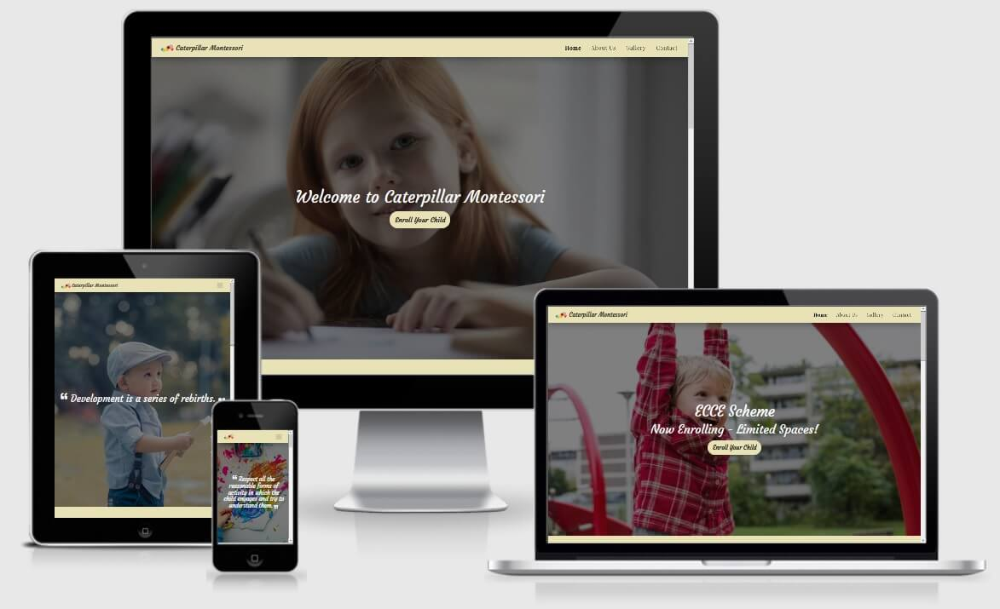

# Caterpillar Montessori

The purpose of this project was to create a small website for a fictional Montessori in order to help the families from community.

[View live project here](https://constantinadrian.github.io/Caterpillar_Montessori_MS_1/)

## Table of Contents

- #### UX:

  - ##### User stories

    I.	First Time Visitor Goals:

    - As a first-time visitor I want to be able to easily navigate through the site.

    - As a first-time visitor I want to understand the main purpose of the site and find out about the services offered.

    - As a first-time visitor I want to find testimonials from established clients.

    II.	Returning User Goals:

    - As a returning visitor, I want to be able to get in contact so I can get more information about a particular subject.

    - As a returning visitor, I want to find links to the social media of the business.

 - ##### Strategy

    - The strategy for having a website is to attract new families and to provide them with information about the services that we have. Having a Montessori website could potentialy generate more income to our Montessori and you’re ahead of your competitors.
    
 - ##### Scope

    - Provide a clean UX for users

    - Provide users with the essential information and keep it simple not to overwhelm with too much content.

    - Provide testemonials from current and past parrents
    
    - Provide with call to action to enroll or contact the Montessori

- ##### Structure

- ###### Features: 

  - ###### Existing Features:
    
    The website it's structure on four pages. 

    1. Home Page - On home page the user can find multiple buttons for call to action, small information about Montessori and activities and testemonials.

    2. About Us Page - Where users can find more information about our Montessori like: our mission, values, our services and Early Childhood Care and Education Programme (ECCE) and our educational / informative videos 

    3. Gallery Page - Where users can have a look at some of our activities that we have we with the children.

    4. Contact Page - Where user can find information on how to contact the Montessori or to use a quick form to send a message 

    - Logo of our Montessori which will take the user to home page

    - The user can navigate from each page with navigation bar at the top, which is fix and always display to the user, or he can navigate from Home page with each call to action button which will take the user to either About page or Contact page. 

    - On the footer of the website the user can find information on how to contact the Montessori, find us on social media or redirect them to other page sections.

  - ###### Future Features to Implement:

    -  Add Sign in page to allow existing users to view the personal updates, photos about their child and to communicate to child teacher more often

    -  Send email from Contact Form to the owner of the website 

- ##### Skeleton

    -  Desktop Wireframes

    -  Tablet Wireframes

    -  Phone Wireframes

- ##### Surface

    -  ##### Colour Scheme

        - Palette:

             

    -  ##### Typography

        - The font-families chosen are Playfair Display and Courgette.

    -  ##### Imagery

        - Because imagery is important I have carefully chosse the background hero image to catch the user's attention.

- #### Technologies Used:

  - ##### Languages:

    - [HTML5](https://en.wikipedia.org/wiki/HTML5) - used to structure website and its content.

    - [CSS3](https://en.wikipedia.org/wiki/CSS) - to format the contents of each webpage.

  - ##### Frameworks, Libraries & Programs:

    - [Bootstrap](https://getbootstrap.com/) – CSS framework used to help with the navbar, carousel, cards

    - [Google Fonts](https://fonts.google.com/) - to import the font-family used in the website: Playfair Display and Courgette

    - [Font Awesome](https://fontawesome.com/) - icons are a visual way to help add meaning to elements.

    - [GitHub](https://github.com/) - used to create and host the repository

    - [Git](https://git-scm.com/) - used for version-control system for tracking changes in any set of files

    - [Gitpod](https://gitpod.io/) - IDE used to develop the project 

  - ##### Additional tools:

    - [VS Code](https://code.visualstudio.com/) - IDE used when Gitpod was having technical issues and run out of hours on Gitpod

    - [Autoprefixer CSS](https://autoprefixer.github.io/) - used to add prefix to css code

    - [Tinypng](https://tinypng.com/) - used to compress all image files in order to reduce loading time on each page

    - [HTML Validator](https://validator.w3.org/) - used to check HTML code for error

    - [CSS Validator](https://jigsaw.w3.org/css-validator/) - used to check CSS code for error

    - [I Am Responsive](http://ami.responsivedesign.is/) - for main image in Readme to show responsive to different screen size

    - [Balsamiq](https://balsamiq.com/) - used to make the wireframes for the project

- #### Testing

    - [HTML Validator](https://validator.w3.org/) - 

    - [CSS Validator](https://jigsaw.w3.org/css-validator/) - 

    - [Lighthouse in Chrome](https://developers.google.com/web/tools/lighthouse) - 

    - [GTMetrix](https://gtmetrix.com/) - 

  - ##### Testing on Different Browsers

  - ##### Testing on Different Devices

- #### Deployment

- #### Credit

  - ##### Code

  - ##### Content

  - ##### Media

  - ##### Acknowledgements