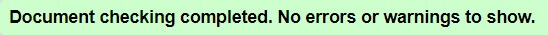
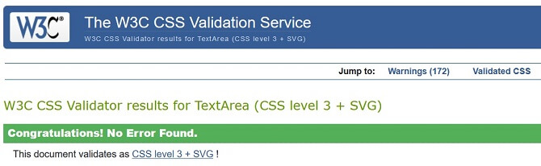

# Caterpillar Montessori


The purpose of this project was to create a small website for a fictional Montessori in order to help the families from community.

[View live project here](https://constantinadrian.github.io/Caterpillar_Montessori_MS_1/)

## Table of Contents

- ### UX:

  - #### User stories

    I.	First Time Visitor Goals:

    - As a first-time visitor I want to understand the main purpose of the site and find out about the services offered.

    - As a first-time visitor I want to be able to easily navigate through the site.

    - As a first-time visitor I want to find testimonials from established clients.

    II.	Returning User Goals:

    - As a returning visitor, I want to be able to get in contact so I can get more information about a particular subject.

    - As a returning visitor, I want to find links to the social media of the business.

 - #### Strategy

    - The strategy for having a website is to attract new families and to provide them with information about the services that we have. Having a Montessori website could potentialy generate more income to our Montessori and you’re ahead of your competitors.
    
 - #### Scope

    - Provide a clean UX for users

    - Provide users with the essential information and keep it simple not to overwhelm with too much content.

    - Provide testemonials from current and past parrents
    
    - Provide with call to action to enroll or contact the Montessori

  - #### Structure

    - ##### Features: 

        Responsive on all screen devices

      - ##### Existing Features:
    
        The website it's structure on four pages. 

        1. Home Page - On home page the user can find multiple buttons for call to action, small information about Montessori and activities and testemonials.

        2. About Us Page - Where users can find more information about our Montessori like: our mission, values, our services and Early Childhood Care and Education Programme (ECCE) and our educational / informative videos 

        3. Gallery Page - Where users can have a look at some of our activities that we have we with the children.

        4. Contact Page - Where user can find information on how to contact the Montessori or to use a quick form to send a message 

        - Logo of our Montessori which will take the user to home page

        - The user can navigate from each page with navigation bar at the top, which is fix and always display to the user, or he can navigate from Home page with each call to action button which will take the user to either About page or Contact page. 

        - On the footer of the website the user can find information on how to contact the Montessori, find us on social media or redirect them to other page sections.

        - Finaly 404 Page - was added in case users direct to a page that does not exist. This was one of the critiria 

      - ##### Future Features to Implement:

        -  Add Sign in page to allow existing users to view the personal updates, photos about their child and to communicate to child teacher more often

        -  Send email from Contact Form to the owner of the website 

- #### Skeleton

    -  Phone Wireframes: [Home](wireframes/home-phone.png) [About](wireframes/about-us-phone.png) [Gallery](wireframes/gallery-phone.png) [Contact](wireframes/contact-phone.png)

    -  Tablet Wireframes: [Home](wireframes/home-tablet.png) [About](wireframes/about-us-tablet.png) [Gallery](wireframes/gallery-tablet.png) [Contact](wireframes/contact-tablet.png)

    -  Desktop Wireframes: [Home](wireframes/home-desktop.png) [About](wireframes/about-us-desktop.png) [Gallery](wireframes/gallery-desktop.png) [Contact](wireframes/contact-desktop.png)

- #### Surface

    -  ##### Colour Scheme

        - Palette:

             

            - The primary color that I choice is lemon-meringue because it inspires: Positivity, Purity and is the symbol of Happiness and Optimism.

            - The secondary color I used is prussian-blue because it is often associated with Stability and it symbolizes Trust, Loyalty and Confidence.

            - The final color I choose is white to be neutral backdrop to the text and other elements that I used on the page (images) and because White represents Purity and Innocence.

            - A Color Gradient was used as well from all colors to design a section of Home page.

    -  ##### Typography

        - The font-families chosen are Playfair Display and Courgette. For the consistency I used Courgette for Logo, Headings and Titles and for the Navigation Bar, Footer and Paragraphs I used Playfair Display.

    -  ##### Imagery

        - Because imagery is important I have carefully chosse the background hero image to catch the user's attention.

- ### Technologies Used:

  - #### Languages:

    - [HTML5](https://en.wikipedia.org/wiki/HTML5) - used to structure website and its content.

    - [CSS3](https://en.wikipedia.org/wiki/CSS) - to format the contents of each webpage.

  - #### Frameworks, Libraries & Programs:

    - [Bootstrap](https://getbootstrap.com/) – CSS framework used to help with the navbar, carousel, cards

    - [Google Fonts](https://fonts.google.com/) - to import the font-family used in the website: Playfair Display and Courgette

    - [Font Awesome](https://fontawesome.com/) - icons are a visual way to help add meaning to elements.

    - [GitHub](https://github.com/) - used to create and host the repository

    - [Git](https://git-scm.com/) - used for version-control system for tracking changes in any set of files

    - [Gitpod](https://gitpod.io/) - IDE used to develop the project 

  - #### Additional tools:

    - [VS Code](https://code.visualstudio.com/) - IDE used when Gitpod was having technical issues and run out of hours on Gitpod

    - [Autoprefixer CSS](https://autoprefixer.github.io/) - used to add prefix to css code

    - [Tinypng](https://tinypng.com/) - used to compress all image files in order to reduce loading time on each page

    - [HTML Validator](https://validator.w3.org/) - used to check HTML code for error

    - [CSS Validator](https://jigsaw.w3.org/css-validator/) - used to check CSS code for error

    - [I Am Responsive](http://ami.responsivedesign.is/) - for main image in Readme to show responsive to different screen size

    - [Balsamiq](https://balsamiq.com/) - used to make the wireframes for the project

    - [Coolors](https://coolors.co/) - used for color palette

    - [Favicon](https://favicon.io/favicon-converter/) - for favicon used on this project

- ### Testing

    - [HTML Validator](https://validator.w3.org/)
        
         - Home Page
         
            

         - About Us Page 
         
             

         - Gallery Page 
         
             

         - Contact Page 
         
              

    - [CSS Validator](https://jigsaw.w3.org/css-validator/) - 
    
        - CSS - style.css
        
            

            - All Warnings were from prefixes 

            

    - [Lighthouse in Chrome](https://developers.google.com/web/tools/lighthouse) - [Home](readme/lighthouse-index.png) [About](readme/lighthouse-about.png) [Gallery](readme/lighthouse-gallery.png) [Contact](readme/lighthouse-contact.png)

    - [GTMetrix](https://gtmetrix.com/) - [Home](readme/gtmetrix-index.png) [About](readme/gtmetrix-about.png) [Gallery](readme/gtmetrix-gallery.png) [Contact](readme/gtmetrix-contact.png)

  - #### Testing User Stories from User Experience (UX) Section

    I. First Time Visitor Goals

      - As a first-time visitor I want to understand the main purpose of the site and find out about the services offered.

        1. As the users enters the site, they are automatically greeted with a clean and easy-to-read navigation bar to access the page of their choice. Below is a Hero Image with Welcome text and a "Enroll Your Child" Call to action button.

        2. The main points are made immediately with the Hero Image and the text.

        3. The users has two options, click the call to action button or to scroll down to learn more about the organisation.

      - As a first-time visitor I want to be able to easily navigate through the site.

        1. The site has been designed to be fluid and never to entrap the user thus I have made the navigation bar fixed so the user can easily used when needed

        2. At the bottom of each page there are link that could easily redirect the users to diffent pages.

      - As a first-time visitor I want to find testimonials from established clients.

        1. As the users scroll down the home page immediately after the why choose us section they will find What Parrents Say section where they can read the testemonials 

    II.	Returning User Goals:

      - As a returning visitor, I want to be able to get in contact so I can get more information about a particular subject.

        1. As the users returning there are several ways to get in contact with the business owner:

            1. On the 3rd Carousel Hero-Image on the Home page there is a Contact Us - Call to action button. 

            2. On the navigation bar of each page there is a link to Contact Us page.

            3. On the footer of each page their is a link to Contact Us page.

      - As a returning visitor, I want to find links to the social media of the business.

        1. The Users can easily find the links to social media on the footer of each page and on the contact page section.

  - #### Testing on Different Browsers

    - The following web browsers were used for testing the browser compatibility and responsive (System:Windows 10 64-bit).

        1. Chrome - Version 87.0

        2. Firefox - Version 84.0.2

        3. Edge - Version 87.0

        4. Opera - Version:73.0

        5. IE - Version 20H2

        All test was good. 

  - #### Testing on Different Devices

    1. Iphone 11 - IOS 14.0.1

    2. Ipad Mini 2 - IOS 12.4.8 

    3. Huawei P Smart

    4. Iphone 5S - IOS 10.2.1

    All test was good except the Iphone 5S (see Bugs)

  - A large amount of testing was done to ensure that all pages were linked correctly.

  - #### Known Bugs

    - On IE all hero image from carousel from index page were stretched.

        - The img tag was remove as object-fit property didn't have support in IE and was replace with div tag with a class attribute in order to set up background image. All images were display correctly after.

    - When added the 404.html Page - the page was not working after multiple attends 

        - On Slack community there was a pinned info about the 404 functionality. All I had to do was to create a 404.md file and place it with the 404.html in the root folder. Even so the 404 Page was working when the redirect was from index.html page as the other pages was move into a folder call "pages". After move all the pages back to root folder the 404 Page was working correctly when the mistype was on any of the pages.

            The 404.md file content:
            ```
            ---
            permalink: /404.html
            ---
            ```
    - On Iphone 5S (IOS 10.2.1) the hover efect on the cards on "Why Choose Us" section does not work and the user can't see the text that it's hidden when interact on the card. 

        - After multiple search I found that the hover effect does not work across all mobile devices, only the latest, as this efect was only for desktops.
    
- ### Deployment

  - #### Inception project 

    1. This project was created from Code Institute project template from [here](https://github.com/Code-Institute-Org/gitpod-full-template) on github by clicking on "Use this template"

        

    2. Once the project was created I remane it from settings 

        

    3. When repository was finally completed I open the project with [Gitpod](https://chrome.google.com/webstore/detail/gitpod-dev-environments-i/dodmmooeoklaejobgleioelladacbeki?hl=en) in Chrome browser

    4. In order to push this project from Gitpod on Github a set of commands were used:

        ```
        - git status  - Check the status of the repository and see if there were any changes in files 

        - git add .  - Add the files that were modified/created, so we can commit it 

        - git commit -m "messsage for commit"  - Commits all the changes

        - git push  - Pushes all committed versions to Github
        ```

  - #### GitHub Pages

    - The project was deployed to GitHub Pages using the following steps:

        1. Log in to GitHub and locate GitHub Repository

        2. At the top of repository click on "Settings"

        3. Once you are in settings scroll down to "Github Pages" 

        4. Under "Source", click the dropdown called "None" and select "Master Branch".

        5. After the page automatically refresh scroll down again on "Github Pages" and I will see live link to the published site.

  - #### Local Clone

    1. Log in to GitHub and locate GitHub Repository

    2. At the top of repository click on Code 

    3. From the dropdown menu under HTTPS copy the link

    4. Now on your IDE create a directory where you wanna make the clone 

    5. Type git clone and paste the link that you copy from step 3. 

- ### Credit

  - #### Code

    - Credit code for social icons - taken and modified from Matt Rudge bootstrap mini project "Resume Project" [Code Institute](https://codeinstitute.net/) 

    - Credit code for Hero image animation - taken and modified from Brian O'Grady Love Running [Code Institute](https://codeinstitute.net/) 

    - Credit code for opaque-overlay used for Hero Image on index page, about and gallery page - from Matt Rudge "Whiskey Drop Project" [Code Institute](https://codeinstitute.net/) 
    - [Bootstrap](https://getbootstrap.com/) - for navbar, carousel, cards, grid system, forms, modal and all other clases that I used for making the project responsive.

    - [Favicon](https://favicon.io/favicon-converter/) - for quickly generate the favicon and given the code for use in this project

  - #### Content

    - The content for this project was adapted from the following websites:

        - http://www.dimples.ie/

        - https://www.whitefriarscreche.ie/

        - http://www.kidorama.ie/index.asp

        - http://kidsunited.ie/

        - https://www.littleharvard.ie/

        - https://bumblebeeschool.com/

        - http://lovablememontessori.ie/

    - Color psychology

        - https://everythingwhat.com/

        - https://www.smashingmagazine.com/2010/01/color-theory-for-designers-part-1-the-meaning-of-color/

  - #### Media

    - All photos used on this project were taken from:

        - https://www.pexels.com/

        - https://burst.shopify.com/

        - https://unsplash.com/

        - https://pixabay.com/

  - #### Acknowledgements

    - [Code Institute](https://codeinstitute.net/) for all course material 

    - Slack community

    - My mentor Oluwafemi Medale for his support and feedback that he give me for this milestone project.